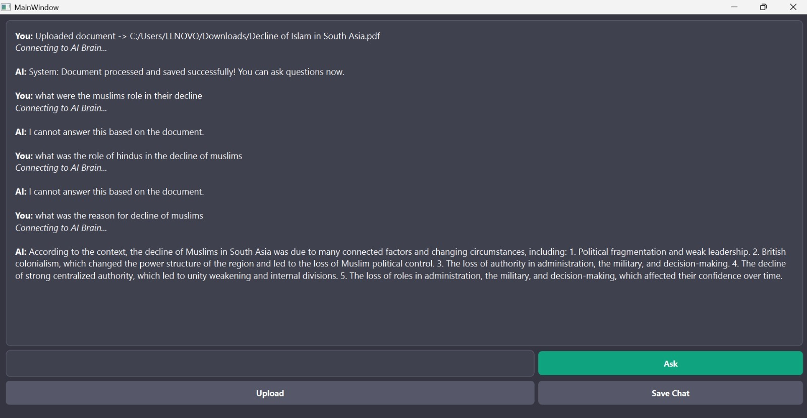

# RAG Chatbot

A Retrieval-Augmented Generation (RAG) chatbot developed using C++, Qt/QML, and the Groq API. The application enables users to upload PDF documents and ask questions based on the uploaded content. By combining document retrieval with Large Language Models (LLMs), the chatbot generates context-aware and relevant responses.

## Features

* Upload and process PDF documents
* Ask questions based on document content
* Retrieval-Augmented Generation (RAG) pipeline
* Context-aware AI responses
* Modern Qt/QML graphical interface
* Chat history support

## Screenshot

## Technologies Used

* C++
* Qt/QML
* Groq API
* Retrieval-Augmented Generation (RAG)
* PDF Processing
* Large Language Models (LLMs)

## How It Works

1. User uploads a PDF document.
2. The document is processed and relevant information is extracted.
3. User asks questions about the document.
4. The system retrieves relevant context from the document.
5. The Groq-powered LLM generates an answer using the retrieved information.

## Future Improvements

* Support for multiple document uploads
* Vector database integration
* Semantic search capabilities
* Citation and source highlighting
* Improved document chunking and retrieval
